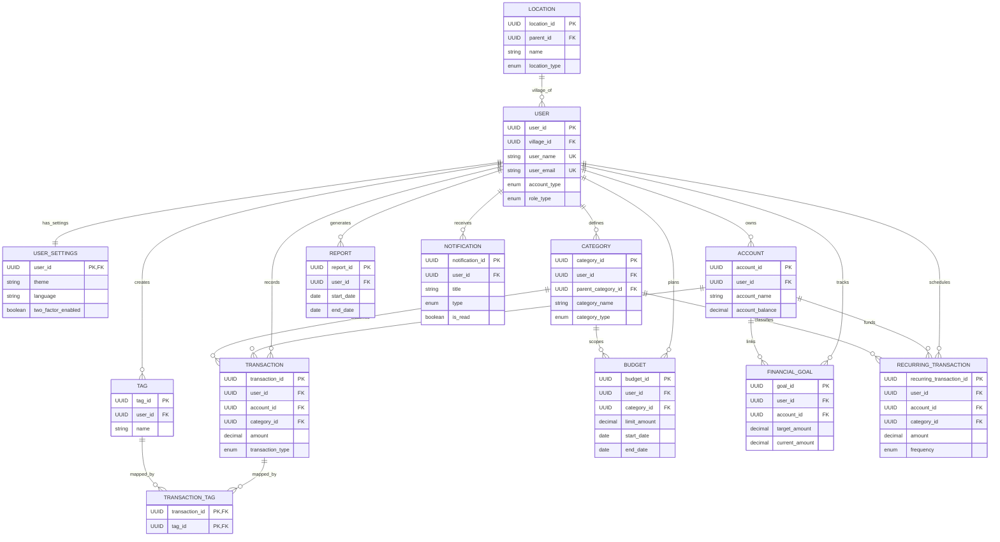
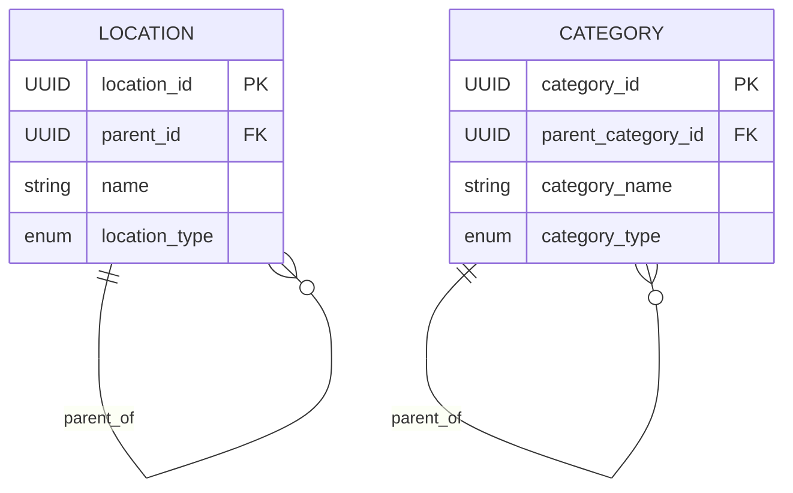

# FinanceTrackerPlatform

A Spring Boot backend for personal finance management. The platform helps users manage accounts, categories, transactions, budgets, goals, recurring activity, notifications, reports, and profile settings in one place.

## What This Project Is

FinanceTrackerPlatform is a REST API built with Java and Spring Boot that supports:

- User registration, authentication, and profile settings
- Account and category management
- Transaction tracking with tags
- Budget planning and spending insights
- Financial goals and recurring transactions
- Notifications and report generation
- Location hierarchy support for user village mapping

## Tech Stack

- Java 17+
- Spring Boot 3.x
- Spring Web, Spring Security, Spring Data JPA, Validation
- PostgreSQL
- Maven

## How It Works

The application is structured in a standard layered architecture:

- Controllers: expose REST endpoints
- Services: business logic
- Repositories: data access with JPA
- Models/Entities: relational data model mapped with Hibernate

Data is stored in PostgreSQL. Hibernate manages schema updates (`ddl-auto=update`) and `data.sql` can seed default data.

## Setup Instructions

### 1. Prerequisites

- JDK 17 or newer
- Maven 3.9+
- PostgreSQL 14+

### 2. Configure Environment Variables

You can use the defaults from `application.properties`, but environment variables are recommended:

- `DB_URL` (example: `jdbc:postgresql://localhost:5432/finance_tracker_db`)
- `DB_USERNAME`
- `DB_PASSWORD`
- `JWT_SECRET`
- `MAIL_USERNAME`
- `MAIL_PASSWORD`
- `OTP_EMAIL_VERIFICATION` (true/false)
- `OTP_CODE_LENGTH`
- `OTP_EXPIRY_MINUTES`

### 3. Run the Application

```bash
./mvnw spring-boot:run
```

On Windows PowerShell:

```powershell
.\mvnw.cmd spring-boot:run
```

### 4. Build and Test

```bash
./mvnw clean test
./mvnw clean package
```

## Database ERD (Mermaid)

Main ERD (optimized for readability):



Hierarchy ERD (self-referencing only):



### Relationship Legend

- One-to-one: `USER` to `USER_SETTINGS`
- One-to-many: `USER` to `ACCOUNT` (and similar)
- Many-to-one: inverse of one-to-many, e.g., each `ACCOUNT` belongs to one `USER`
- Many-to-many: `TRANSACTION` to `TAG` via `TRANSACTION_TAG`
- Self-referencing: shown in the dedicated Hierarchy ERD (`LOCATION` to `LOCATION`, `CATEGORY` to `CATEGORY`) to avoid clutter

## Included ERD Image Exports

- `FinanceTracker_ERD.svg`
- `FinanceTracker_ERD.png`

## License

This project is for educational and development use.
